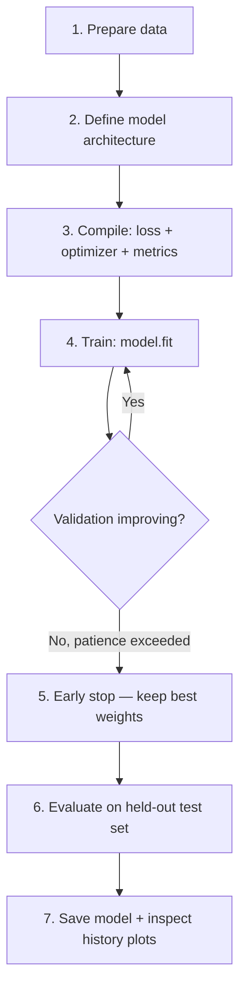

# CNN Guide — concepts, building blocks & training

A personal reference for when you forget how CNNs work, what each piece does, and **why** it is there. Read top-to-bottom once, then jump to any section later.

**Typical use case:** image classification — but **you do not need a literal image**. CNNs work on any **grid-like or sequential data** where local patterns matter (audio, spectrograms, time series, video frames). See [Audio & CNNs](#audio--cnns-no-image-required).

---

## Table of contents

1. [Big picture](#big-picture)
2. [Step-by-step: from image to trained model](#step-by-step-from-image-to-trained-model)
3. [Architecture: input → hidden → output](#architecture-input--hidden--output)
4. [Building blocks (what each part is and why)](#building-blocks-what-each-part-is-and-why)
5. [Training concepts (epochs, batches, history, early stop)](#training-concepts-epochs-batches-history-early-stop)
6. [Loss, optimizers & learning rate](#loss-optimizers--learning-rate)
7. [Data: splits, augmentation, class imbalance](#data-splits-augmentation-class-imbalance)
8. [Transfer learning & fine-tuning](#transfer-learning--fine-tuning)
9. [Evaluation: what to look at after training](#evaluation-what-to-look-at-after-training)
10. [Common architecture patterns](#common-architecture-patterns)
11. [Audio & CNNs (no image required)](#audio--cnns-no-image-required)
12. [Quick glossary](#quick-glossary)

---

## Big picture

A **Convolutional Neural Network (CNN)** is a neural network designed for **grid or sequence data** — images are the most common example, but not the only one. Instead of connecting every input to every neuron at once, it uses **convolution** — small filters that slide over the input and detect **local patterns** (edges in an image, frequency bursts in a spectrogram, short motifs in a waveform).

```text
Image (pixels)  →  CNN layers  →  numbers (logits)  →  activation  →  prediction
                     ↑
              learns patterns during training
```

**Why convolutions instead of plain Dense layers on raw pixels?**

- A 224×224 RGB image has ~150k inputs. A Dense layer with 256 neurons would need tens of millions of weights — slow, huge, easy to overfit.
- Convolutions share the same small filter everywhere → fewer parameters, translation-aware (a cat eye in the top-left is detected similarly to one in the bottom-right).

---

## Step-by-step: from image to trained model

Use this as the mental checklist whenever you build or read a CNN project.



| Step | What you do | What to remember |
|------|-------------|------------------|
| **1. Data** | Load images, resize, normalize, split train/val/test | Model only sees numbers in a fixed range (often 0–1 or -1–1) |
| **2. Architecture** | Stack Conv → activation → pool → … → Dense → output | Early layers = low-level; late layers = high-level |
| **3. Compile** | Pick loss (e.g. categorical crossentropy), optimizer (e.g. Adam), metrics (accuracy) | Compile = tell Keras *how* to measure error and update weights |
| **4. Train** | `model.fit(x, y, epochs=…, batch_size=…, validation_data=…)` | One **epoch** = one full pass over the training set |
| **5. Early stop** | Stop if val loss stops improving for N epochs | Prevents wasting time and overfitting |
| **6. Evaluate** | Test set, confusion matrix, per-class metrics | Test set must never have been used during training or early-stop decisions |
| **7. Save** | `model.save(...)` | Saved weights + architecture for inference later |

---

## Architecture: input → hidden → output

Every neural network has three conceptual zones:

```text
INPUT          HIDDEN LAYERS              OUTPUT
(raw data)     (learn representations)    (final prediction)
```

| Zone | Role | Trainable? | Example (7-class image classifier) |
|------|------|------------|-----------------------------------|
| **Input** | Declares shape the model expects | No | `(224, 224, 3)` = H × W × RGB |
| **Hidden** | Transform pixels → useful features | Yes | Conv blocks, pooling, Dense layers with ReLU |
| **Output** | Map features → class scores | Yes | `Dense(7)` + **Softmax** → 7 probabilities |

**Rule of thumb:** hidden layers = “feature extraction”; output layer = “decision.” For multi-class classification, output neuron count = **number of classes**.

---

## Building blocks (what each part is and why)

### Input layer

- **What:** Declares tensor shape, e.g. `Input(shape=(height, width, 3))`.
- **Why:** Every downstream layer must know dimensions. Images are usually **height × width × channels** (3 for RGB, 1 for grayscale).
- **Not** a layer that learns weights — it is a placeholder for the data tensor.

---

### Conv2D (convolution layer)

- **What:** Applies many small **kernels** (filters) that slide across the image.
- **Why:** Detects **local** patterns hierarchically — edges → textures → parts → objects.

```text
Image  ──convolve──►  Feature map 1  (e.g. vertical edges)
       ──convolve──►  Feature map 2  (e.g. horizontal edges)
       ──convolve──►  Feature map 3  (e.g. blobs of color)
       ...
```

**Keras example:** `Conv2D(filters=32, kernel_size=(3, 3), activation='relu')`

| Parameter | Meaning |
|-----------|---------|
| `filters=32` | 32 different kernels → 32 feature maps |
| `kernel_size=(3,3)` | Each kernel is 3×3 spatially (depth matches input channels) |
| `strides` | How many pixels the kernel jumps (default 1) |
| `padding='same'` | Pad so output size matches input (when stride=1) |

**Kernel (filter):** a small learned weight matrix (e.g. 3×3×3 for RGB input). Each kernel produces one **feature map**. Early layers often learn edges and color blobs; deeper layers learn parts and object-level structure.

---

### Activation functions

An activation is applied **after** a layer’s linear computation (weighted sum + bias). It introduces **non-linearity**.

**Why non-linearity matters:** without it, stacking many layers is equivalent to a single linear layer — the network could not learn curved boundaries or complex patterns.

| Activation | Formula / behavior | Typical use | Why choose it |
|------------|-------------------|-------------|---------------|
| **ReLU** | `max(0, x)` | Hidden Conv and Dense layers | Fast, avoids vanishing gradient in many cases; default choice |
| **Softmax** | Exp normalize so outputs sum to 1 | **Multi-class output** (mutually exclusive classes) | Gives a probability distribution over classes |
| **Sigmoid** | Squashes to (0, 1) | **Binary** output OR multi-label per neuron | One probability per neuron; classes can co-occur |
| **Linear** | `f(x) = x` | **Regression** output | Predict a continuous value (price, age, coordinate) |
| **Leaky ReLU / ELU** | Variants of ReLU | Hidden layers when dead ReLUs are a problem | Less common; ReLU is still the default to try first |

**Output layer cheat sheet:**

```text
3 classes, pick exactly one     →  Dense(3, activation='softmax')
2 classes (cat vs dog)            →  Dense(1, activation='sigmoid')  OR  Dense(2, softmax)
Predict house price             →  Dense(1, activation='linear')
Tag image with multiple labels  →  Dense(n, activation='sigmoid')  (multi-label)
```

---

### Pooling

- **What:** Reduces **spatial** size (width/height) of feature maps.
- **Why:** Fewer parameters downstream, slight translation invariance, less compute. Keeps the “strongest” or “average” signal in each region.

| Type | Behavior | When to use |
|------|----------|-------------|
| **MaxPooling2D(2,2)** | Max value in each 2×2 window | Most common after Conv blocks |
| **AveragePooling2D** | Mean in each window | Smoother downsampling |
| **GlobalAveragePooling2D** | Entire H×W map → one number per channel | Before Dense head in modern architectures; replaces huge Flatten |

**Example:** 64×64 feature map + `MaxPooling2D(2,2)` → 32×32.

---

### Flatten vs GlobalAveragePooling2D

| | **Flatten** | **GlobalAveragePooling2D (GAP)** |
|---|-------------|----------------------------------|
| **What** | Unrolls all spatial positions into one long vector | Averages each channel’s map to a single value |
| **Output size** | H × W × channels (can be huge) | channels only |
| **Typical use** | Small CNNs, older designs | Transfer-learning heads, modern classifiers |

---

### Dense (fully connected) layer

- **What:** Every neuron connects to **every** input from the previous layer.
- **Why:** Combines all extracted features into a decision. Used **after** convolutions have produced a compact representation.

**Neurons (units):** `Dense(256)` = 256 neurons. Each computes:

```text
output = activation( w₁x₁ + w₂x₂ + … + wₙxₙ + bias )
```

**How many neurons?**

| Layer | Typical size | Reasoning |
|-------|--------------|-----------|
| Hidden Dense | 128–1024 (task-dependent) | More capacity = can learn harder mappings; too many → overfitting |
| Output Dense | **Exactly = number of classes** (classification) | One score (logit) per class before softmax |

There is no magic formula. Start moderate (256–512), watch train vs validation curves, adjust if underfitting (both bad) or overfitting (train good, val bad).

**Conv “neurons”:** in Conv2D, think in terms of **filters**, not individual neurons. Each filter is like one detector producing one feature map.

---

### Dropout

- **What:** During **training only**, randomly sets a fraction of neuron outputs to **0** (e.g. `Dropout(0.5)` = 50% dropped each batch).
- **Why:** **Regularization** — stops the network from memorizing specific neurons (“co-adaptation”). Forces redundant, robust pathways.

| Rate | Meaning |
|------|---------|
| `0.2`–`0.3` | Light regularization |
| `0.5` | Common on large Dense layers |
| `0.0` / omit | No dropout |

**At inference time:** dropout is **off** — all neurons active (Keras scales weights automatically during training to compensate).

**Where to put it:** usually after Dense layers (and sometimes after Conv blocks), **before** the next layer.

---

### Batch normalization (BatchNorm)

- **What:** Normalizes activations within each mini-batch (learnable scale/shift).
- **Why:** Stabilizes training, often allows higher learning rates, reduces internal covariate shift.
- **Where:** Often after Conv/Dense and **before** activation (or after, depending on architecture — follow the pattern of the model you copy).

Pre-built models (ResNet, DenseNet, etc.) include BatchNorm inside their blocks.

---

### L2 regularization

- **What:** Adds a penalty to the loss proportional to the **square of weights** (`kernel_regularizer=l2(0.01)`).
- **Why:** Keeps weights small → smoother decision boundaries, less overfitting.
- **Alternative/complement to:** dropout, more data, simpler model.

---

## Training concepts (epochs, batches, history, early stop)

### Epoch

- **What:** One complete pass through the **entire training dataset** (all batches).
- **Why it matters:** Training is iterative. The model sees each example many times; each pass refines weights a bit more.

```text
10,000 images, batch_size=32  →  ~313 batches per epoch  →  1 epoch = 313 weight updates
```

**How many epochs?** Not fixed. Use validation curves + early stopping instead of guessing a perfect number upfront. Common starting range: 20–100 for small projects; transfer learning often needs fewer on the head, more when fine-tuning.

---

### Batch size

- **What:** Number of samples processed **before one gradient update**.
- **Why:** Memory vs stability tradeoff.

| Larger batch (64–128+) | Smaller batch (8–32) |
|------------------------|----------------------|
| Faster per epoch on GPU | Noisier gradients — sometimes better generalization |
| Needs more VRAM | Fits on smaller GPU |
| Smoother loss curve | More weight updates per epoch |

---

### Steps per epoch

```text
steps_per_epoch = ceil(training_samples / batch_size)
```

With `ImageDataGenerator.flow_from_directory`, Keras can infer this automatically if the dataset size is known.

---

### History (`history` object)

- **What:** Return value of `model.fit(...)` — a dict of metrics **per epoch**.
- **Why:** Your primary debugging tool after training.

```python
history = model.fit(..., validation_data=(x_val, y_val))

history.history.keys()
# e.g. ['loss', 'accuracy', 'val_loss', 'val_accuracy']
```

| Key | Meaning |
|-----|---------|
| `loss` | Training loss (how wrong on training data) |
| `val_loss` | Validation loss (how wrong on held-out val set) |
| `accuracy` / `val_accuracy` | Fraction correct (classification) |

**How to read plots:**

```text
Both loss ↓, both acc ↑        →  learning (good)
Train loss ↓, val loss ↑       →  overfitting (model memorizing train set)
Both flat early                →  underfitting or LR too low / model too small
```

Always plot **train vs validation** on the same chart.

---

### Early stopping

- **What:** Callback that **stops training** when a monitored metric stops improving for `patience` epochs. Usually restores **best** weights from before the stall.

```python
EarlyStopping(
    monitor='val_loss',      # watch validation loss
    patience=5,              # stop after 5 epochs with no improvement
    restore_best_weights=True
)
```

| Parameter | Meaning |
|-----------|---------|
| `monitor` | `'val_loss'` (common), `'val_accuracy'`, etc. |
| `patience` | How many epochs to wait without improvement |
| `restore_best_weights` | Roll back to the epoch with best val metric |

**Why:** Saves time; reduces overfitting by not training 50 extra epochs after the model peaked on validation data.

**Important:** validation set must be **separate** from training data and used consistently for early stopping — never tune on the test set.

---

### Other useful callbacks (brief)

| Callback | Purpose |
|----------|---------|
| `ModelCheckpoint` | Save best model during training |
| `ReduceLROnPlateau` | Lower learning rate when val loss plateaus |
| `TensorBoard` | Log scalars and graphs for visualization |

---

## Loss, optimizers & learning rate

### Loss function

Measures **how wrong** predictions are. The optimizer tries to **minimize** this.

| Task | Loss | Labels format |
|------|------|---------------|
| Multi-class (one label per image) | `categorical_crossentropy` | One-hot: `[0,0,1,0,…]` |
| Multi-class (integer label) | `sparse_categorical_crossentropy` | Integer: `2` means class 2 |
| Binary | `binary_crossentropy` | 0 or 1 |
| Regression | `mse` / `mae` | Continuous number |

**Softmax + categorical crossentropy** go together for multi-class single-label classification.

---

### Optimizer

Updates weights using gradients from the loss.

| Optimizer | Notes |
|-----------|-------|
| **Adam** | Good default; adaptive learning rate per parameter |
| **SGD** | Classic; often used with momentum; common in fine-tuning with explicit LR |
| **RMSprop** | Alternative adaptive; less common now |

---

### Learning rate (LR)

- **What:** Step size for each weight update. Too high → unstable loss; too low → painfully slow or stuck.
- **Typical values:** `1e-3` (0.001) for Adam from scratch; `1e-5` to `1e-4` for fine-tuning a pre-trained backbone.

**Transfer learning pattern:**

```text
Phase 1 (frozen backbone):  train head only,  LR ~ 1e-2 to 1e-3
Phase 2 (fine-tune all):      unfreeze backbone, LR ~ 1e-4 to 1e-5  (much lower!)
```

Lower LR in phase 2 because pre-trained weights are already good — large updates would **destroy** useful features.

---

## Data: splits, augmentation, class imbalance

### Train / validation / test

| Split | Purpose | Used during training? |
|-------|---------|------------------------|
| **Train** | Learn weights | Yes — every batch |
| **Validation** | Tune stopping, compare runs, detect overfitting | Yes — after each epoch (no gradient update) |
| **Test** | Final unbiased score | **No** — only once at the end |

Common split: 80% train, 10% val, 10% test — or 80/20 train+val with a separate test folder.

---

### Normalization / preprocessing

Models expect consistent pixel scales:

| Approach | Range | Notes |
|----------|-------|-------|
| `rescale=1./255` | 0–1 | Simple baseline |
| Model-specific preprocess | e.g. -1 to 1 | `applications.mobilenet.preprocess_input` — **match the pre-trained model you use** |

Always apply the **same** preprocessing at train and inference time.

---

### Data augmentation

Random transforms applied **on the fly** during training only (flip, rotate, zoom, shift).

- **Why:** Artificially increases diversity → better generalization, less overfitting.
- **Never** augment validation/test — you want stable, repeatable evaluation.

---

### Class imbalance

When some classes have far fewer examples:

- **Class weights:** upweight rare classes in the loss (`class_weight={0: 1.0, 1: 3.5, …}`).
- **More data** for rare classes, oversampling, or focal loss (advanced).

---

## Transfer learning & fine-tuning

**Problem:** training a deep CNN from scratch needs **lots** of labeled images and time.

**Transfer learning:** start from a model **pre-trained** on a large dataset (usually ImageNet — 1000 general object classes). Reuse its convolutional layers as a **feature extractor**, add your own **classification head**.

```text
Pre-trained backbone (Conv blocks)     Custom head (your task)
         ↓                                    ↓
   edges, textures, shapes        →    GlobalPool → Dense → Softmax(num_classes)
```

### Two-phase training (standard recipe)

| Phase | Backbone | Learning rate | Goal |
|-------|----------|---------------|------|
| **1 — Feature extraction** | **Frozen** (`trainable=False`) | Higher (e.g. 1e-3) | Train new head only; fast, stable |
| **2 — Fine-tuning** | **Unfrozen** (`trainable=True`) | **Much lower** (e.g. 1e-4) | Adapt low-level features slightly to your domain |

**When transfer learning works well:** your images share visual structure with pre-training (natural photos, faces, objects). Less ideal for radically different domains (medical X-rays, satellite multispectral) unless you use a domain-specific pre-trained model.

**Popular backbones in Keras:** `ResNet50`, `DenseNet169`, `EfficientNetB0`, `MobileNetV2` — all via `tensorflow.keras.applications`.

---

## Evaluation: what to look at after training

| Tool | What it tells you |
|------|-------------------|
| **Accuracy** | Overall % correct — misleading if classes are imbalanced |
| **Confusion matrix** | Which classes get confused with which |
| **Precision / Recall / F1** | Per-class performance |
| **ROC / PR curves** | Threshold tradeoffs (especially imbalanced or binary) |
| **Train vs val curves** | Overfitting vs underfitting at a glance |

**Confusion matrix read tip:** row = true class, column = predicted class. Large off-diagonal values = systematic mistakes to investigate (bad labels? similar classes? need more data?).

---

## Common architecture patterns

### Minimal CNN (from scratch)

Good for learning; needs more data than transfer learning.

```text
Input (H×W×3)
  → Conv2D(32, 3×3) → ReLU → MaxPooling2D(2×2)
  → Conv2D(64, 3×3) → ReLU → MaxPooling2D(2×2)
  → Flatten
  → Dense(128) → ReLU → Dropout(0.5)
  → Dense(num_classes) → Softmax
```

### Transfer-learning classifier head

Typical head after a frozen backbone:

```text
Backbone output (H'×W'×C)
  → GlobalAveragePooling2D
  → Dense(256) → ReLU → Dropout(0.3)
  → Dense(num_classes) → Softmax
```

Deeper heads (512 → 1024 → …) add capacity but also overfitting risk — justify with data size and validation curves.

---

## Audio & CNNs (no image required)

**Key idea:** raw audio is a **1D signal** (amplitude over time). You do **not** need a JPEG or PNG. You need a representation the conv layers can slide over — either the waveform itself (**Conv1D**) or a derived **2D time–frequency grid** (**Conv2D** on a spectrogram).

Mel spectrograms are **one popular choice**, not a requirement.

### What the CNN actually needs

| Requirement | Meaning |
|-------------|---------|
| **Structured layout** | Neighbors in the input carry related information |
| **Local patterns** | Short motifs repeat or matter (a chirp, a rotor hum, an edge) |
| **Not** a literal image file | A spectrogram matrix or sample sequence is enough |

If your data is a flat unordered list of numbers (spreadsheet row with age, income, zip code), a CNN is usually the **wrong** tool — use tree models or a plain MLP instead.

### Three common audio paths

#### Path A — 1D CNN on the raw waveform (no spectrogram)

```text
.wav samples  [s₁, s₂, s₃, …, sₙ]
       ↓
Conv1D → ReLU → pool → Conv1D → … → Dense → Softmax
       ↑
  filter slides along TIME only
```

- **Pros:** End-to-end; no hand-built frequency step.
- **Cons:** Long clips = very long sequences; may need more data or downsampling.
- **Keras:** `layers.Conv1D(filters=64, kernel_size=400, …)` — kernel spans a short **time window** of raw samples.

#### Path B — 2D CNN on a spectrogram (mel or STFT)

```text
.wav  →  STFT / mel transform  →  2D grid (time × frequency)
       ↓
Conv2D → … → GlobalAveragePooling2D → Dense → Softmax
       ↑
  filter slides over TIME and FREQUENCY (like a tiny patch on a heatmap)
```

- **Pros:** Well-studied; Conv2D tooling matches image pipelines; mel scale matches human hearing.
- **Cons:** Extra preprocessing step; hyperparameters (window size, hop length, `n_mels`).
- **Mel spectrogram:** log-scaled energy in Mel frequency bins — **not** an image file, but shaped like a grayscale “picture” the network can convolve over.

**Example task:** classify drone vs helicopter vs background from `.wav` files — compute mel spec per clip, stack into `(time_frames, n_mels, 1)`, run a Conv2D stack (same building blocks as the image guide).

#### Path C — Pre-trained audio model (transfer learning)

```text
.wav  →  frozen embedding model (YAMNet, VGGish, PANNs, …)  →  vector
       ↓
Dense head (or fine-tune last layers)
```

- **Pros:** Strong when you have **little labeled data**.
- **Cons:** Dependency on external weights; domain mismatch if audio is very unlike pre-training.

### Mel spectrogram — what it is (not why you must use it)

| Step | What happens |
|------|----------------|
| 1. Window the signal | Chop audio into short overlapping frames |
| 2. FFT / STFT | Each frame → frequency content |
| 3. Mel filterbank | Merge Hz bins into Mel bands (log-like spacing) |
| 4. Log scale | `log(mel_energy)` for stable dynamic range |

Output shape is roughly **`(num_time_frames, n_mels)`** — e.g. `(128, 64)` — one channel (`1`) or stacked for multi-channel input.

**Why people use mel:** compact, perceptually motivated, works great with Conv2D. **If you skip mel**, use Path A or C instead — the CNN does not care about file extensions, only tensor shape.

### Same CNN concepts, different axis labels

| Image CNN | Audio CNN (spectrogram) | Audio CNN (waveform) |
|-----------|-------------------------|----------------------|
| Conv2D on H×W | Conv2D on time×frequency | Conv1D on time |
| Edge detectors | Horizontal bands = tones; vertical bursts = transients | Short temporal motifs |
| RGB channels | Often 1 channel (log-mel energy) | 1 channel (amplitude) |
| Augmentation: flip, rotate | Augmentation: time shift, noise, pitch/time stretch (on spec or wave) | Time shift, gain, noise |

Training is identical: compile with loss + optimizer, `fit()`, watch `history`, early stopping, softmax on `num_classes`.

### Decision cheat sheet

```text
Have .wav / time-series audio?
  │
  ├─ Small dataset, want strong baseline     →  transfer learning (Path C)
  ├─ Want simple pipeline, no spec math      →  Conv1D on waveform (Path A)
  ├─ Classic approach, image-like tooling    →  mel spectrogram + Conv2D (Path B)
  └─ Tabular features only (no sequence)     →  NOT a CNN — use XGBoost / MLP
```

### Minimal mental model

```text
CNN needs:  "something I can slide a small window over"
Images:     pixels in 2D
Audio A:    samples in 1D        → Conv1D
Audio B:    energy in time×freq  → Conv2D (mel optional, not mandatory)
```

---

## Quick glossary

| Term | One-line definition |
|------|---------------------|
| **CNN** | Neural network using convolution for grid or sequence data (images, spectrograms, waveforms) |
| **Conv1D** | Convolution along one axis (e.g. raw audio over time) |
| **Conv2D** | Convolution along two axes (e.g. image H×W or spectrogram time×frequency) |
| **Mel spectrogram** | 2D log-energy grid (time × Mel bands); common audio input for Conv2D, not mandatory |
| **Spectrogram** | Time–frequency representation of a signal (STFT magnitude, mel, etc.) |
| **Kernel / filter** | Small weight matrix slid over the image to produce a feature map |
| **Feature map** | Output of one conv filter — highlights where a pattern was detected |
| **Channel** | Depth dimension (3 for RGB; grows with number of filters) |
| **Conv layer** | Applies learnable filters locally across the input |
| **Pooling** | Downsamples spatial dimensions of feature maps |
| **Dense / FC** | Every input connected to every neuron |
| **Neuron / unit** | One node computing weighted sum + activation |
| **Activation** | Non-linear function after a layer (ReLU, softmax, …) |
| **ReLU** | `max(0,x)` — default hidden activation |
| **Softmax** | Output probabilities over classes (sum to 1) |
| **Dropout** | Randomly zero neurons during training — regularization |
| **BatchNorm** | Normalize layer inputs per batch — stabilizes training |
| **Epoch** | One full pass through the training set |
| **Batch** | Subset of data processed before one weight update |
| **Loss** | Scalar measuring prediction error — what training minimizes |
| **Optimizer** | Algorithm that updates weights from loss gradients |
| **Learning rate** | Step size for weight updates |
| **History** | Per-epoch logs from `fit()` (loss, accuracy, val_*) |
| **Early stopping** | Stop when validation metric stops improving |
| **Overfitting** | Model memorizes train data; poor on new data |
| **Underfitting** | Model too simple; poor on both train and val |
| **Transfer learning** | Reuse pre-trained weights on a new task |
| **Fine-tuning** | Train (some or all) pre-trained layers on new data with low LR |
| **Backbone** | Pre-trained feature extractor (conv blocks) |
| **Head** | Custom layers added for your specific task |
| **Augmentation** | Random training-time transforms to improve generalization |
| **Class weights** | Loss weighting to handle imbalanced classes |

---

## Memory hooks (when you blank on the exam)

1. **Conv** = local pattern detectors. **Dense** = global combination. **Pool** = shrink spatial size.
2. **ReLU** in hidden layers. **Softmax** on multi-class output (one winner). **Sigmoid** on binary or multi-label.
3. **Output neurons = number of classes** (for single-label classification).
4. **Epoch** = saw all training data once. **Batch** = chunk processed per update.
5. **History** = plot `loss` vs `val_loss` — they diverge → overfitting.
6. **Early stop** = quit when `val_loss` stalls; keep best checkpoint.
7. **Dropout** = only during training; fights overfitting.
8. **Transfer learning:** freeze backbone first, train head; then unfreeze with **small LR**.
9. **Test set** = touch once at the very end.
10. **Audio:** no image file needed — Conv1D on waveform **or** Conv2D on spectrogram (mel is optional).
